# Entity relationship diagrams

_Generated by `npm run docs` from the migrated database (96 tables). Do not edit by hand._

Conventions: every table has a UUID `id` primary key (except pure link/derived tables), `company_id` (tenant), and where operational `branch_id`.
Audit columns (`created_by`, `updated_by`, approvers) and `company_id` → `org.companies` links exist on almost every table and are omitted from the diagrams for readability; see SCHEMA.md.

## Domain overview

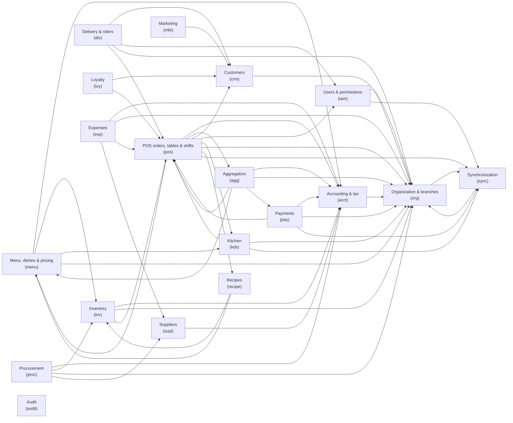
```mermaid
flowchart LR
  org["Organization & branches<br/>(org)"]
  iam["Users & permissions<br/>(iam)"]
  crm["Customers<br/>(crm)"]
  menu["Menu, dishes & pricing<br/>(menu)"]
  recipe["Recipes<br/>(recipe)"]
  pos["POS orders, tables & shifts<br/>(pos)"]
  pay["Payments<br/>(pay)"]
  inv["Inventory<br/>(inv)"]
  proc["Procurement<br/>(proc)"]
  supl["Suppliers<br/>(supl)"]
  kds["Kitchen<br/>(kds)"]
  dlv["Delivery & riders<br/>(dlv)"]
  agg["Aggregators<br/>(agg)"]
  loy["Loyalty<br/>(loy)"]
  mkt["Marketing<br/>(mkt)"]
  exp["Expenses<br/>(exp)"]
  acct["Accounting & tax<br/>(acct)"]
  sync["Synchronization<br/>(sync)"]
  audit["Audit<br/>(audit)"]
  acct --> org
  agg --> acct
  agg --> menu
  agg --> org
  agg --> pay
  agg --> pos
  crm --> org
  dlv --> crm
  dlv --> iam
  dlv --> org
  dlv --> pos
  exp --> acct
  exp --> org
  exp --> pos
  exp --> supl
  iam --> org
  iam --> sync
  inv --> acct
  inv --> org
  inv --> pos
  kds --> org
  kds --> pos
  kds --> sync
  loy --> crm
  loy --> pos
  menu --> acct
  menu --> inv
  menu --> kds
  menu --> org
  mkt --> crm
  org --> sync
  pay --> acct
  pay --> org
  pay --> pos
  pay --> sync
  pos --> acct
  pos --> agg
  pos --> crm
  pos --> iam
  pos --> kds
  pos --> menu
  pos --> org
  pos --> recipe
  pos --> sync
  proc --> acct
  proc --> inv
  proc --> org
  proc --> supl
  recipe --> inv
  recipe --> menu
  supl --> acct
  sync --> org
```

## Organization & branches (`org`)

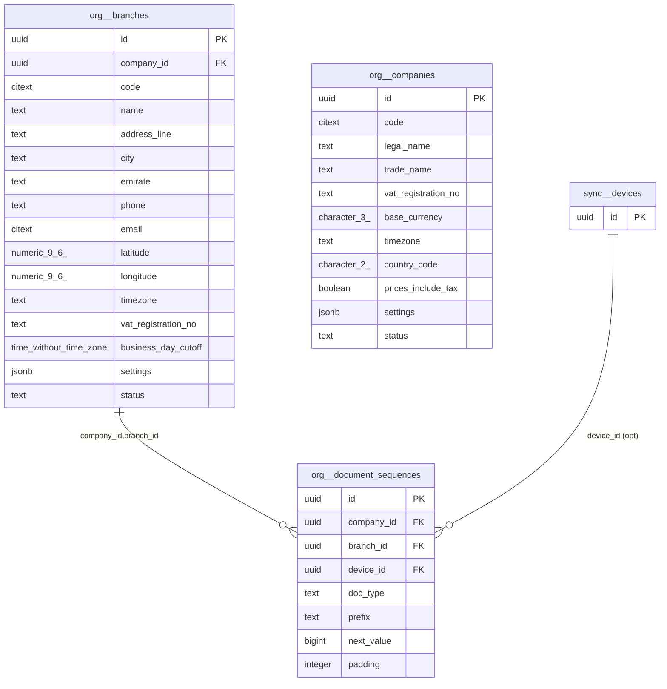
```mermaid
erDiagram
  org__branches {
    uuid id PK
    uuid company_id FK
    citext code
    text name
    text address_line
    text city
    text emirate
    text phone
    citext email
    numeric_9_6_ latitude
    numeric_9_6_ longitude
    text timezone
    text vat_registration_no
    time_without_time_zone business_day_cutoff
    jsonb settings
    text status
  }
  org__companies {
    uuid id PK
    citext code
    text legal_name
    text trade_name
    text vat_registration_no
    character_3_ base_currency
    text timezone
    character_2_ country_code
    boolean prices_include_tax
    jsonb settings
    text status
  }
  org__document_sequences {
    uuid id PK
    uuid company_id FK
    uuid branch_id FK
    uuid device_id FK
    text doc_type
    text prefix
    bigint next_value
    integer padding
  }
  sync__devices {
    uuid id PK
  }
  org__branches ||--o{ org__document_sequences : "company_id,branch_id"
  sync__devices ||--o{ org__document_sequences : "device_id (opt)"
```

## Users & permissions (`iam`)

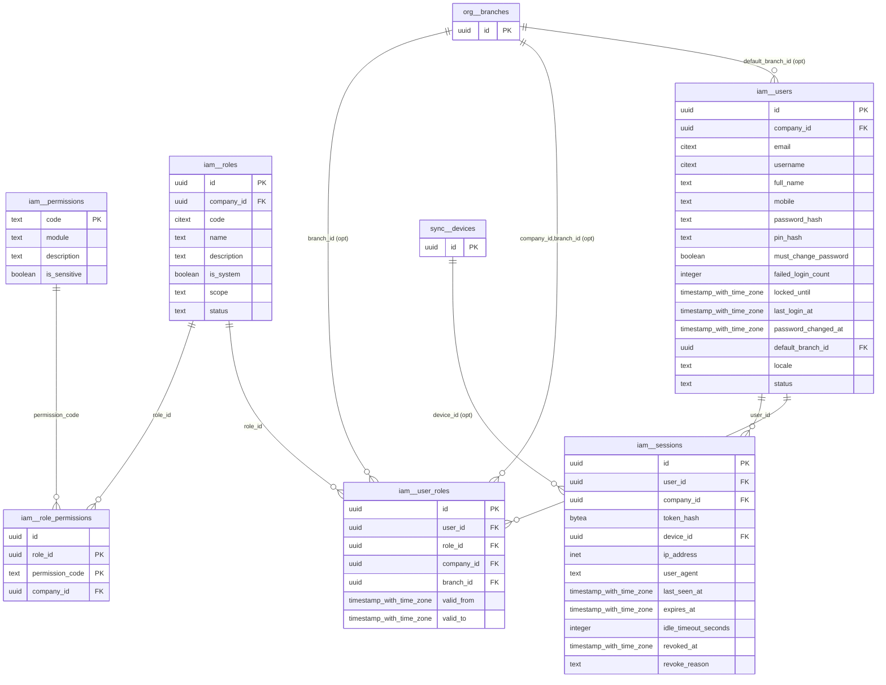
```mermaid
erDiagram
  iam__permissions {
    text code PK
    text module
    text description
    boolean is_sensitive
  }
  iam__role_permissions {
    uuid id
    uuid role_id PK
    text permission_code PK
    uuid company_id FK
  }
  iam__roles {
    uuid id PK
    uuid company_id FK
    citext code
    text name
    text description
    boolean is_system
    text scope
    text status
  }
  iam__sessions {
    uuid id PK
    uuid user_id FK
    uuid company_id FK
    bytea token_hash
    uuid device_id FK
    inet ip_address
    text user_agent
    timestamp_with_time_zone last_seen_at
    timestamp_with_time_zone expires_at
    integer idle_timeout_seconds
    timestamp_with_time_zone revoked_at
    text revoke_reason
  }
  iam__user_roles {
    uuid id PK
    uuid user_id FK
    uuid role_id FK
    uuid company_id FK
    uuid branch_id FK
    timestamp_with_time_zone valid_from
    timestamp_with_time_zone valid_to
  }
  iam__users {
    uuid id PK
    uuid company_id FK
    citext email
    citext username
    text full_name
    text mobile
    text password_hash
    text pin_hash
    boolean must_change_password
    integer failed_login_count
    timestamp_with_time_zone locked_until
    timestamp_with_time_zone last_login_at
    timestamp_with_time_zone password_changed_at
    uuid default_branch_id FK
    text locale
    text status
  }
  sync__devices {
    uuid id PK
  }
  org__branches {
    uuid id PK
  }
  iam__permissions ||--o{ iam__role_permissions : "permission_code"
  iam__roles ||--o{ iam__role_permissions : "role_id"
  sync__devices ||--o{ iam__sessions : "device_id (opt)"
  iam__users ||--o{ iam__sessions : "user_id"
  org__branches ||--o{ iam__user_roles : "branch_id (opt)"
  org__branches ||--o{ iam__user_roles : "company_id,branch_id (opt)"
  iam__roles ||--o{ iam__user_roles : "role_id"
  iam__users ||--o{ iam__user_roles : "user_id"
  org__branches ||--o{ iam__users : "default_branch_id (opt)"
```

## Customers (`crm`)

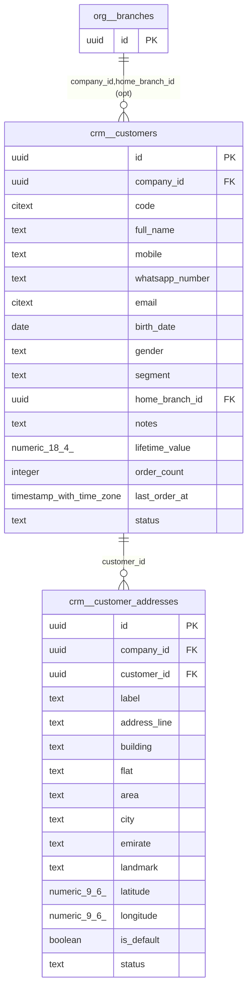
```mermaid
erDiagram
  crm__customer_addresses {
    uuid id PK
    uuid company_id FK
    uuid customer_id FK
    text label
    text address_line
    text building
    text flat
    text area
    text city
    text emirate
    text landmark
    numeric_9_6_ latitude
    numeric_9_6_ longitude
    boolean is_default
    text status
  }
  crm__customers {
    uuid id PK
    uuid company_id FK
    citext code
    text full_name
    text mobile
    text whatsapp_number
    citext email
    date birth_date
    text gender
    text segment
    uuid home_branch_id FK
    text notes
    numeric_18_4_ lifetime_value
    integer order_count
    timestamp_with_time_zone last_order_at
    text status
  }
  org__branches {
    uuid id PK
  }
  crm__customers ||--o{ crm__customer_addresses : "customer_id"
  org__branches ||--o{ crm__customers : "company_id,home_branch_id (opt)"
```

## Menu, dishes & pricing (`menu`)

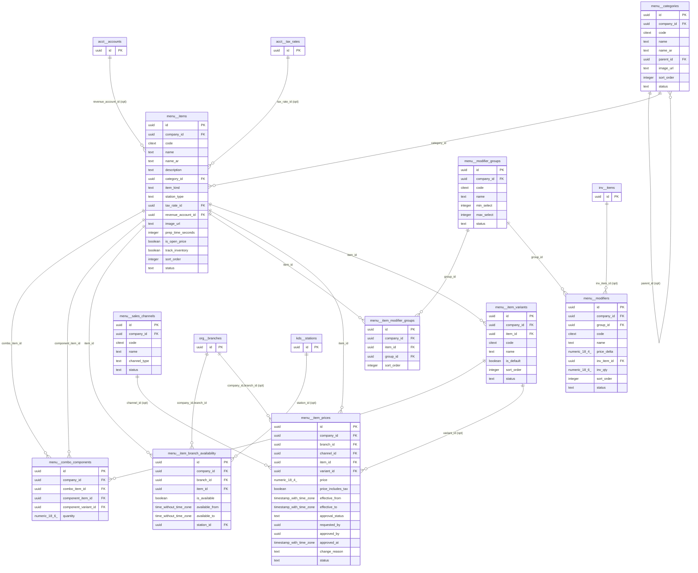
```mermaid
erDiagram
  menu__categories {
    uuid id PK
    uuid company_id FK
    citext code
    text name
    text name_ar
    uuid parent_id FK
    text image_url
    integer sort_order
    text status
  }
  menu__combo_components {
    uuid id PK
    uuid company_id FK
    uuid combo_item_id FK
    uuid component_item_id FK
    uuid component_variant_id FK
    numeric_18_6_ quantity
  }
  menu__item_branch_availability {
    uuid id PK
    uuid company_id FK
    uuid branch_id FK
    uuid item_id FK
    boolean is_available
    time_without_time_zone available_from
    time_without_time_zone available_to
    uuid station_id FK
  }
  menu__item_modifier_groups {
    uuid id PK
    uuid company_id FK
    uuid item_id FK
    uuid group_id FK
    integer sort_order
  }
  menu__item_prices {
    uuid id PK
    uuid company_id FK
    uuid branch_id FK
    uuid channel_id FK
    uuid item_id FK
    uuid variant_id FK
    numeric_18_4_ price
    boolean price_includes_tax
    timestamp_with_time_zone effective_from
    timestamp_with_time_zone effective_to
    text approval_status
    uuid requested_by
    uuid approved_by
    timestamp_with_time_zone approved_at
    text change_reason
    text status
  }
  menu__item_variants {
    uuid id PK
    uuid company_id FK
    uuid item_id FK
    citext code
    text name
    boolean is_default
    integer sort_order
    text status
  }
  menu__items {
    uuid id PK
    uuid company_id FK
    citext code
    text name
    text name_ar
    text description
    uuid category_id FK
    text item_kind
    text station_type
    uuid tax_rate_id FK
    uuid revenue_account_id FK
    text image_url
    integer prep_time_seconds
    boolean is_open_price
    boolean track_inventory
    integer sort_order
    text status
  }
  menu__modifier_groups {
    uuid id PK
    uuid company_id FK
    citext code
    text name
    integer min_select
    integer max_select
    text status
  }
  menu__modifiers {
    uuid id PK
    uuid company_id FK
    uuid group_id FK
    citext code
    text name
    numeric_18_4_ price_delta
    uuid inv_item_id FK
    numeric_18_6_ inv_qty
    integer sort_order
    text status
  }
  menu__sales_channels {
    uuid id PK
    uuid company_id FK
    citext code
    text name
    text channel_type
    text status
  }
  org__branches {
    uuid id PK
  }
  kds__stations {
    uuid id PK
  }
  acct__accounts {
    uuid id PK
  }
  acct__tax_rates {
    uuid id PK
  }
  inv__items {
    uuid id PK
  }
  menu__categories ||--o{ menu__categories : "parent_id (opt)"
  menu__items ||--o{ menu__combo_components : "combo_item_id"
  menu__items ||--o{ menu__combo_components : "component_item_id"
  menu__item_variants ||--o{ menu__combo_components : "component_variant_id (opt)"
  org__branches ||--o{ menu__item_branch_availability : "company_id,branch_id"
  menu__items ||--o{ menu__item_branch_availability : "item_id"
  kds__stations ||--o{ menu__item_branch_availability : "station_id (opt)"
  menu__modifier_groups ||--o{ menu__item_modifier_groups : "group_id"
  menu__items ||--o{ menu__item_modifier_groups : "item_id"
  menu__sales_channels ||--o{ menu__item_prices : "channel_id (opt)"
  org__branches ||--o{ menu__item_prices : "company_id,branch_id (opt)"
  menu__items ||--o{ menu__item_prices : "item_id"
  menu__item_variants ||--o{ menu__item_prices : "variant_id (opt)"
  menu__items ||--o{ menu__item_variants : "item_id"
  menu__categories ||--o{ menu__items : "category_id"
  acct__accounts ||--o{ menu__items : "revenue_account_id (opt)"
  acct__tax_rates ||--o{ menu__items : "tax_rate_id (opt)"
  menu__modifier_groups ||--o{ menu__modifiers : "group_id"
  inv__items ||--o{ menu__modifiers : "inv_item_id (opt)"
```

## Recipes (`recipe`)

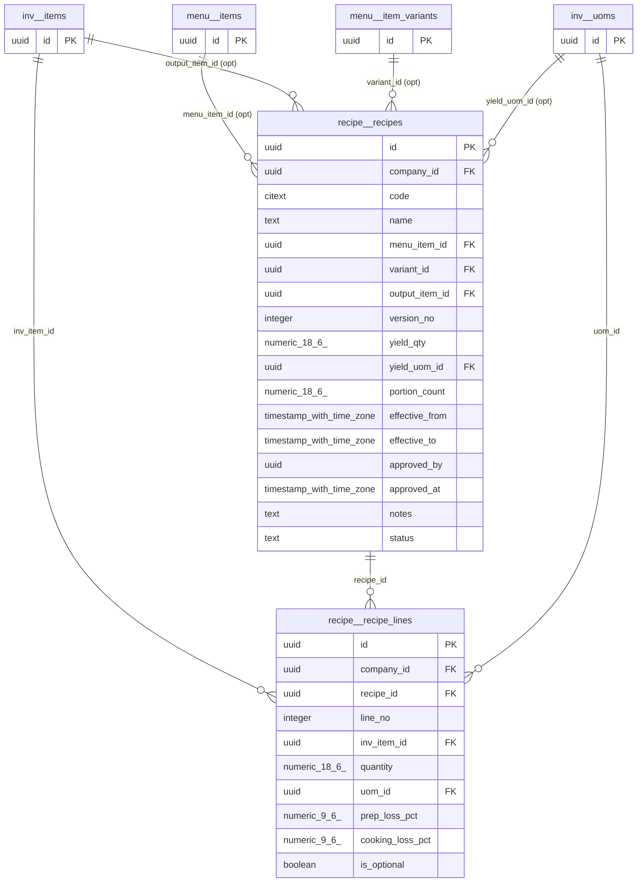
```mermaid
erDiagram
  recipe__recipe_lines {
    uuid id PK
    uuid company_id FK
    uuid recipe_id FK
    integer line_no
    uuid inv_item_id FK
    numeric_18_6_ quantity
    uuid uom_id FK
    numeric_9_6_ prep_loss_pct
    numeric_9_6_ cooking_loss_pct
    boolean is_optional
  }
  recipe__recipes {
    uuid id PK
    uuid company_id FK
    citext code
    text name
    uuid menu_item_id FK
    uuid variant_id FK
    uuid output_item_id FK
    integer version_no
    numeric_18_6_ yield_qty
    uuid yield_uom_id FK
    numeric_18_6_ portion_count
    timestamp_with_time_zone effective_from
    timestamp_with_time_zone effective_to
    uuid approved_by
    timestamp_with_time_zone approved_at
    text notes
    text status
  }
  inv__items {
    uuid id PK
  }
  inv__uoms {
    uuid id PK
  }
  menu__items {
    uuid id PK
  }
  menu__item_variants {
    uuid id PK
  }
  inv__items ||--o{ recipe__recipe_lines : "inv_item_id"
  recipe__recipes ||--o{ recipe__recipe_lines : "recipe_id"
  inv__uoms ||--o{ recipe__recipe_lines : "uom_id"
  menu__items ||--o{ recipe__recipes : "menu_item_id (opt)"
  inv__items ||--o{ recipe__recipes : "output_item_id (opt)"
  menu__item_variants ||--o{ recipe__recipes : "variant_id (opt)"
  inv__uoms ||--o{ recipe__recipes : "yield_uom_id (opt)"
```

## POS orders, tables & shifts (`pos`)

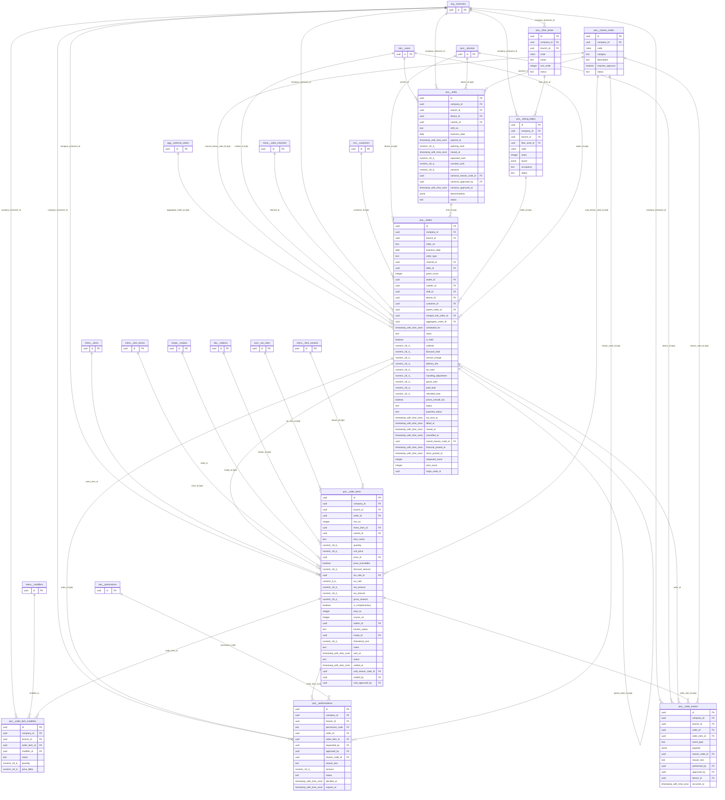
```mermaid
erDiagram
  pos__authorizations {
    uuid id PK
    uuid company_id FK
    uuid branch_id FK
    text permission_code FK
    uuid order_id FK
    uuid order_item_id FK
    uuid requested_by FK
    uuid approved_by FK
    uuid reason_code_id FK
    text reason_text
    numeric_18_4_ amount
    text status
    timestamp_with_time_zone decided_at
    timestamp_with_time_zone expires_at
  }
  pos__dining_tables {
    uuid id PK
    uuid company_id FK
    uuid branch_id FK
    uuid floor_area_id FK
    citext code
    integer seats
    jsonb layout
    text occupancy
    text status
  }
  pos__floor_areas {
    uuid id PK
    uuid company_id FK
    uuid branch_id FK
    citext code
    text name
    integer sort_order
    text status
  }
  pos__order_events {
    uuid id PK
    uuid company_id FK
    uuid branch_id FK
    uuid order_id FK
    uuid order_item_id FK
    text event_type
    jsonb payload
    uuid reason_code_id FK
    text reason_text
    uuid performed_by FK
    uuid approved_by FK
    uuid device_id FK
    timestamp_with_time_zone occurred_at
  }
  pos__order_item_modifiers {
    uuid id PK
    uuid company_id FK
    uuid branch_id FK
    uuid order_item_id FK
    uuid modifier_id FK
    text name
    numeric_18_6_ quantity
    numeric_18_4_ price_delta
  }
  pos__order_items {
    uuid id PK
    uuid company_id FK
    uuid branch_id FK
    uuid order_id FK
    integer line_no
    uuid menu_item_id FK
    uuid variant_id FK
    text item_name
    numeric_18_6_ quantity
    numeric_18_4_ unit_price
    uuid price_id FK
    boolean price_overridden
    numeric_18_4_ discount_amount
    uuid tax_rate_id FK
    numeric_9_6_ tax_rate
    numeric_18_4_ net_amount
    numeric_18_4_ tax_amount
    numeric_18_4_ gross_amount
    boolean is_complimentary
    integer seat_no
    integer course_no
    uuid station_id FK
    text kitchen_status
    uuid recipe_id FK
    numeric_18_4_ theoretical_cost
    text notes
    timestamp_with_time_zone sent_at
    text status
    timestamp_with_time_zone voided_at
    uuid void_reason_code_id FK
    uuid voided_by FK
    uuid void_approved_by FK
  }
  pos__orders {
    uuid id PK
    uuid company_id FK
    uuid branch_id FK
    text order_no
    date business_date
    text order_type
    uuid channel_id FK
    uuid table_id FK
    integer guest_count
    uuid waiter_id FK
    uuid cashier_id FK
    uuid shift_id FK
    uuid device_id FK
    uuid customer_id FK
    uuid parent_order_id FK
    uuid merged_into_order_id FK
    uuid aggregator_order_id FK
    timestamp_with_time_zone scheduled_for
    text notes
    boolean is_held
    numeric_18_4_ subtotal
    numeric_18_4_ discount_total
    numeric_18_4_ service_charge
    numeric_18_4_ delivery_fee
    numeric_18_4_ tax_total
    numeric_18_4_ rounding_adjustment
    numeric_18_4_ grand_total
    numeric_18_4_ paid_total
    numeric_18_4_ refunded_total
    boolean prices_include_tax
    text status
    text payment_status
    timestamp_with_time_zone kot_sent_at
    timestamp_with_time_zone billed_at
    timestamp_with_time_zone closed_at
    timestamp_with_time_zone cancelled_at
    uuid cancel_reason_code_id FK
    timestamp_with_time_zone financial_posted_at
    timestamp_with_time_zone stock_posted_at
    integer reopened_count
    integer print_count
    uuid origin_node_id
  }
  pos__reason_codes {
    uuid id PK
    uuid company_id FK
    citext code
    text category
    text description
    boolean requires_approval
    text status
  }
  pos__shifts {
    uuid id PK
    uuid company_id FK
    uuid branch_id FK
    uuid device_id FK
    uuid cashier_id FK
    text shift_no
    date business_date
    timestamp_with_time_zone opened_at
    numeric_18_4_ opening_cash
    timestamp_with_time_zone closed_at
    numeric_18_4_ expected_cash
    numeric_18_4_ counted_cash
    numeric_18_4_ variance
    uuid variance_reason_code_id FK
    uuid variance_approved_by FK
    timestamp_with_time_zone variance_approved_at
    jsonb denominations
    text status
  }
  org__branches {
    uuid id PK
  }
  iam__permissions {
    uuid id PK
  }
  sync__devices {
    uuid id PK
  }
  menu__modifiers {
    uuid id PK
  }
  menu__items {
    uuid id PK
  }
  menu__item_prices {
    uuid id PK
  }
  recipe__recipes {
    uuid id PK
  }
  kds__stations {
    uuid id PK
  }
  acct__tax_rates {
    uuid id PK
  }
  menu__item_variants {
    uuid id PK
  }
  agg__external_orders {
    uuid id PK
  }
  iam__users {
    uuid id PK
  }
  menu__sales_channels {
    uuid id PK
  }
  crm__customers {
    uuid id PK
  }
  org__branches ||--o{ pos__authorizations : "company_id,branch_id"
  pos__orders ||--o{ pos__authorizations : "order_id (opt)"
  pos__order_items ||--o{ pos__authorizations : "order_item_id (opt)"
  iam__permissions ||--o{ pos__authorizations : "permission_code"
  pos__reason_codes ||--o{ pos__authorizations : "reason_code_id (opt)"
  org__branches ||--o{ pos__dining_tables : "company_id,branch_id"
  pos__floor_areas ||--o{ pos__dining_tables : "floor_area_id"
  org__branches ||--o{ pos__floor_areas : "company_id,branch_id"
  org__branches ||--o{ pos__order_events : "company_id,branch_id"
  sync__devices ||--o{ pos__order_events : "device_id (opt)"
  pos__orders ||--o{ pos__order_events : "order_id"
  pos__order_items ||--o{ pos__order_events : "order_item_id (opt)"
  pos__reason_codes ||--o{ pos__order_events : "reason_code_id (opt)"
  org__branches ||--o{ pos__order_item_modifiers : "company_id,branch_id"
  menu__modifiers ||--o{ pos__order_item_modifiers : "modifier_id"
  pos__order_items ||--o{ pos__order_item_modifiers : "order_item_id"
  org__branches ||--o{ pos__order_items : "company_id,branch_id"
  menu__items ||--o{ pos__order_items : "menu_item_id"
  pos__orders ||--o{ pos__order_items : "order_id"
  menu__item_prices ||--o{ pos__order_items : "price_id (opt)"
  recipe__recipes ||--o{ pos__order_items : "recipe_id (opt)"
  kds__stations ||--o{ pos__order_items : "station_id (opt)"
  acct__tax_rates ||--o{ pos__order_items : "tax_rate_id (opt)"
  menu__item_variants ||--o{ pos__order_items : "variant_id (opt)"
  pos__reason_codes ||--o{ pos__order_items : "void_reason_code_id (opt)"
  agg__external_orders ||--o{ pos__orders : "aggregator_order_id (opt)"
  pos__reason_codes ||--o{ pos__orders : "cancel_reason_code_id (opt)"
  iam__users ||--o{ pos__orders : "cashier_id (opt)"
  menu__sales_channels ||--o{ pos__orders : "channel_id"
  org__branches ||--o{ pos__orders : "company_id,branch_id"
  crm__customers ||--o{ pos__orders : "customer_id (opt)"
  sync__devices ||--o{ pos__orders : "device_id (opt)"
  pos__orders ||--o{ pos__orders : "merged_into_order_id (opt)"
  pos__orders ||--o{ pos__orders : "parent_order_id (opt)"
  pos__shifts ||--o{ pos__orders : "shift_id (opt)"
  pos__dining_tables ||--o{ pos__orders : "table_id (opt)"
  iam__users ||--o{ pos__orders : "waiter_id (opt)"
  iam__users ||--o{ pos__shifts : "cashier_id"
  org__branches ||--o{ pos__shifts : "company_id,branch_id"
  sync__devices ||--o{ pos__shifts : "device_id (opt)"
  pos__reason_codes ||--o{ pos__shifts : "variance_reason_code_id (opt)"
```

## Payments (`pay`)

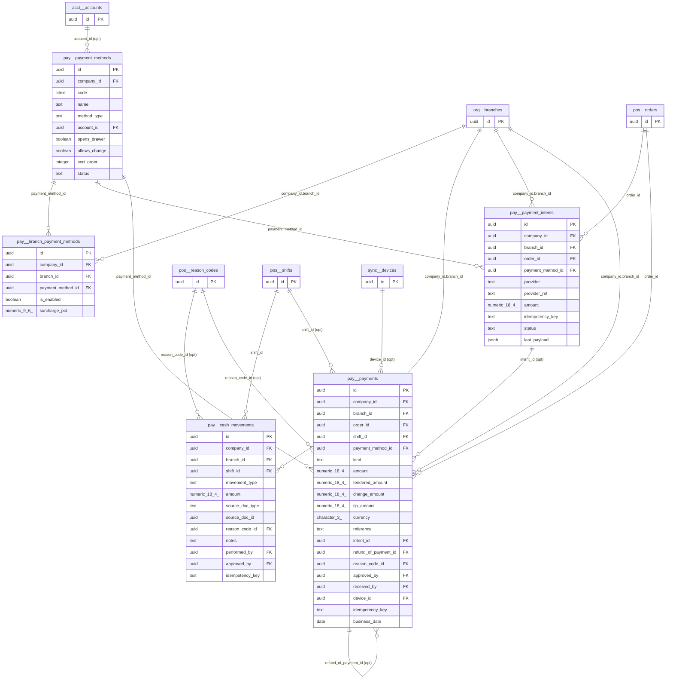
```mermaid
erDiagram
  pay__branch_payment_methods {
    uuid id PK
    uuid company_id FK
    uuid branch_id FK
    uuid payment_method_id FK
    boolean is_enabled
    numeric_9_6_ surcharge_pct
  }
  pay__cash_movements {
    uuid id PK
    uuid company_id FK
    uuid branch_id FK
    uuid shift_id FK
    text movement_type
    numeric_18_4_ amount
    text source_doc_type
    uuid source_doc_id
    uuid reason_code_id FK
    text notes
    uuid performed_by FK
    uuid approved_by FK
    text idempotency_key
  }
  pay__payment_intents {
    uuid id PK
    uuid company_id FK
    uuid branch_id FK
    uuid order_id FK
    uuid payment_method_id FK
    text provider
    text provider_ref
    numeric_18_4_ amount
    text idempotency_key
    text status
    jsonb last_payload
  }
  pay__payment_methods {
    uuid id PK
    uuid company_id FK
    citext code
    text name
    text method_type
    uuid account_id FK
    boolean opens_drawer
    boolean allows_change
    integer sort_order
    text status
  }
  pay__payments {
    uuid id PK
    uuid company_id FK
    uuid branch_id FK
    uuid order_id FK
    uuid shift_id FK
    uuid payment_method_id FK
    text kind
    numeric_18_4_ amount
    numeric_18_4_ tendered_amount
    numeric_18_4_ change_amount
    numeric_18_4_ tip_amount
    character_3_ currency
    text reference
    uuid intent_id FK
    uuid refund_of_payment_id FK
    uuid reason_code_id FK
    uuid approved_by FK
    uuid received_by FK
    uuid device_id FK
    text idempotency_key
    date business_date
  }
  org__branches {
    uuid id PK
  }
  pos__reason_codes {
    uuid id PK
  }
  pos__shifts {
    uuid id PK
  }
  pos__orders {
    uuid id PK
  }
  acct__accounts {
    uuid id PK
  }
  sync__devices {
    uuid id PK
  }
  org__branches ||--o{ pay__branch_payment_methods : "company_id,branch_id"
  pay__payment_methods ||--o{ pay__branch_payment_methods : "payment_method_id"
  org__branches ||--o{ pay__cash_movements : "company_id,branch_id"
  pos__reason_codes ||--o{ pay__cash_movements : "reason_code_id (opt)"
  pos__shifts ||--o{ pay__cash_movements : "shift_id"
  org__branches ||--o{ pay__payment_intents : "company_id,branch_id"
  pos__orders ||--o{ pay__payment_intents : "order_id"
  pay__payment_methods ||--o{ pay__payment_intents : "payment_method_id"
  acct__accounts ||--o{ pay__payment_methods : "account_id (opt)"
  org__branches ||--o{ pay__payments : "company_id,branch_id"
  sync__devices ||--o{ pay__payments : "device_id (opt)"
  pay__payment_intents ||--o{ pay__payments : "intent_id (opt)"
  pos__orders ||--o{ pay__payments : "order_id"
  pay__payment_methods ||--o{ pay__payments : "payment_method_id"
  pos__reason_codes ||--o{ pay__payments : "reason_code_id (opt)"
  pay__payments ||--o{ pay__payments : "refund_of_payment_id (opt)"
  pos__shifts ||--o{ pay__payments : "shift_id (opt)"
```

## Inventory (`inv`)

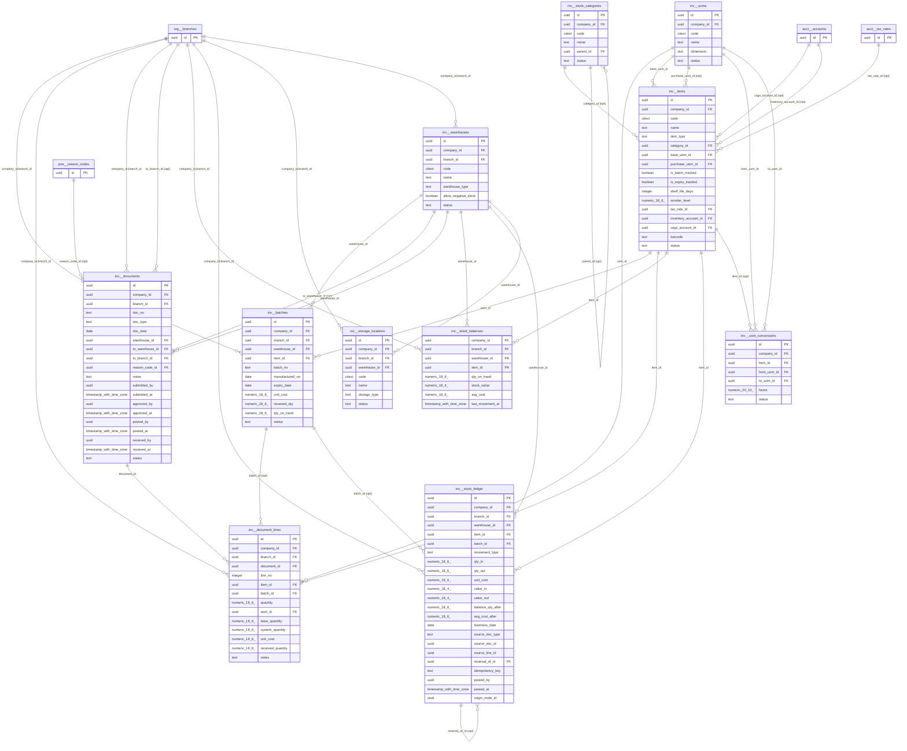
```mermaid
erDiagram
  inv__batches {
    uuid id PK
    uuid company_id FK
    uuid branch_id FK
    uuid warehouse_id FK
    uuid item_id FK
    text batch_no
    date manufactured_on
    date expiry_date
    numeric_18_6_ unit_cost
    numeric_18_6_ received_qty
    numeric_18_6_ qty_on_hand
    text status
  }
  inv__document_lines {
    uuid id PK
    uuid company_id FK
    uuid branch_id FK
    uuid document_id FK
    integer line_no
    uuid item_id FK
    uuid batch_id FK
    numeric_18_6_ quantity
    uuid uom_id FK
    numeric_18_6_ base_quantity
    numeric_18_6_ system_quantity
    numeric_18_6_ unit_cost
    numeric_18_6_ received_quantity
    text notes
  }
  inv__documents {
    uuid id PK
    uuid company_id FK
    uuid branch_id FK
    text doc_no
    text doc_type
    date doc_date
    uuid warehouse_id FK
    uuid to_warehouse_id FK
    uuid to_branch_id FK
    uuid reason_code_id FK
    text notes
    uuid submitted_by
    timestamp_with_time_zone submitted_at
    uuid approved_by
    timestamp_with_time_zone approved_at
    uuid posted_by
    timestamp_with_time_zone posted_at
    uuid received_by
    timestamp_with_time_zone received_at
    text status
  }
  inv__items {
    uuid id PK
    uuid company_id FK
    citext code
    text name
    text item_type
    uuid category_id FK
    uuid base_uom_id FK
    uuid purchase_uom_id FK
    boolean is_batch_tracked
    boolean is_expiry_tracked
    integer shelf_life_days
    numeric_18_6_ reorder_level
    uuid tax_rate_id FK
    uuid inventory_account_id FK
    uuid cogs_account_id FK
    text barcode
    text status
  }
  inv__stock_balances {
    uuid company_id FK
    uuid branch_id FK
    uuid warehouse_id PK
    uuid item_id PK
    numeric_18_6_ qty_on_hand
    numeric_18_4_ stock_value
    numeric_18_6_ avg_cost
    timestamp_with_time_zone last_movement_at
  }
  inv__stock_categories {
    uuid id PK
    uuid company_id FK
    citext code
    text name
    uuid parent_id FK
    text status
  }
  inv__stock_ledger {
    uuid id PK
    uuid company_id FK
    uuid branch_id FK
    uuid warehouse_id FK
    uuid item_id FK
    uuid batch_id FK
    text movement_type
    numeric_18_6_ qty_in
    numeric_18_6_ qty_out
    numeric_18_6_ unit_cost
    numeric_18_4_ value_in
    numeric_18_4_ value_out
    numeric_18_6_ balance_qty_after
    numeric_18_6_ avg_cost_after
    date business_date
    text source_doc_type
    uuid source_doc_id
    uuid source_line_id
    uuid reversal_of_id FK
    text idempotency_key
    uuid posted_by
    timestamp_with_time_zone posted_at
    uuid origin_node_id
  }
  inv__storage_locations {
    uuid id PK
    uuid company_id FK
    uuid branch_id FK
    uuid warehouse_id FK
    citext code
    text name
    text storage_type
    text status
  }
  inv__uom_conversions {
    uuid id PK
    uuid company_id FK
    uuid item_id FK
    uuid from_uom_id FK
    uuid to_uom_id FK
    numeric_20_10_ factor
    text status
  }
  inv__uoms {
    uuid id PK
    uuid company_id FK
    citext code
    text name
    text dimension
    text status
  }
  inv__warehouses {
    uuid id PK
    uuid company_id FK
    uuid branch_id FK
    citext code
    text name
    text warehouse_type
    boolean allow_negative_stock
    text status
  }
  org__branches {
    uuid id PK
  }
  pos__reason_codes {
    uuid id PK
  }
  acct__accounts {
    uuid id PK
  }
  acct__tax_rates {
    uuid id PK
  }
  org__branches ||--o{ inv__batches : "company_id,branch_id"
  inv__items ||--o{ inv__batches : "item_id"
  inv__warehouses ||--o{ inv__batches : "warehouse_id"
  inv__batches ||--o{ inv__document_lines : "batch_id (opt)"
  org__branches ||--o{ inv__document_lines : "company_id,branch_id"
  inv__documents ||--o{ inv__document_lines : "document_id"
  inv__items ||--o{ inv__document_lines : "item_id"
  inv__uoms ||--o{ inv__document_lines : "uom_id"
  org__branches ||--o{ inv__documents : "company_id,branch_id"
  pos__reason_codes ||--o{ inv__documents : "reason_code_id (opt)"
  org__branches ||--o{ inv__documents : "to_branch_id (opt)"
  inv__warehouses ||--o{ inv__documents : "to_warehouse_id (opt)"
  inv__warehouses ||--o{ inv__documents : "warehouse_id"
  inv__uoms ||--o{ inv__items : "base_uom_id"
  inv__stock_categories ||--o{ inv__items : "category_id (opt)"
  acct__accounts ||--o{ inv__items : "cogs_account_id (opt)"
  acct__accounts ||--o{ inv__items : "inventory_account_id (opt)"
  inv__uoms ||--o{ inv__items : "purchase_uom_id (opt)"
  acct__tax_rates ||--o{ inv__items : "tax_rate_id (opt)"
  org__branches ||--o{ inv__stock_balances : "company_id,branch_id"
  inv__items ||--o{ inv__stock_balances : "item_id"
  inv__warehouses ||--o{ inv__stock_balances : "warehouse_id"
  inv__stock_categories ||--o{ inv__stock_categories : "parent_id (opt)"
  inv__batches ||--o{ inv__stock_ledger : "batch_id (opt)"
  org__branches ||--o{ inv__stock_ledger : "company_id,branch_id"
  inv__items ||--o{ inv__stock_ledger : "item_id"
  inv__stock_ledger ||--o{ inv__stock_ledger : "reversal_of_id (opt)"
  inv__warehouses ||--o{ inv__stock_ledger : "warehouse_id"
  org__branches ||--o{ inv__storage_locations : "company_id,branch_id"
  inv__warehouses ||--o{ inv__storage_locations : "warehouse_id"
  inv__uoms ||--o{ inv__uom_conversions : "from_uom_id"
  inv__items ||--o{ inv__uom_conversions : "item_id (opt)"
  inv__uoms ||--o{ inv__uom_conversions : "to_uom_id"
  org__branches ||--o{ inv__warehouses : "company_id,branch_id"
```

## Procurement (`proc`)

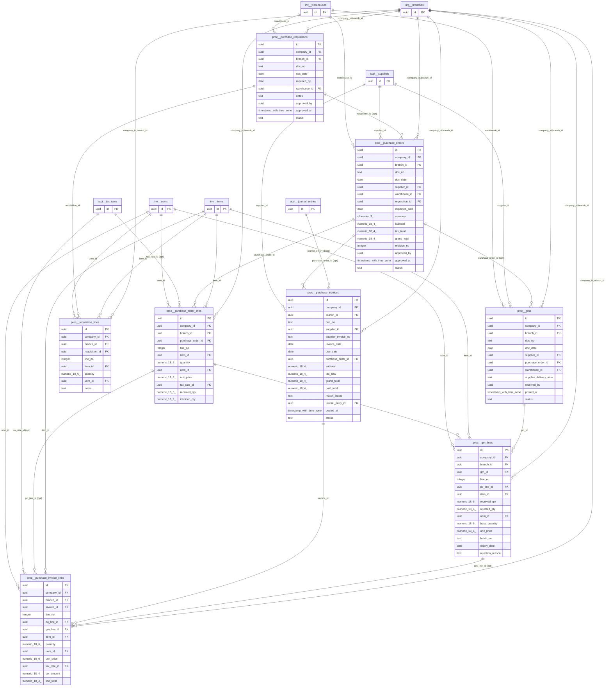
```mermaid
erDiagram
  proc__grn_lines {
    uuid id PK
    uuid company_id FK
    uuid branch_id FK
    uuid grn_id FK
    integer line_no
    uuid po_line_id FK
    uuid item_id FK
    numeric_18_6_ received_qty
    numeric_18_6_ rejected_qty
    uuid uom_id FK
    numeric_18_6_ base_quantity
    numeric_18_6_ unit_price
    text batch_no
    date expiry_date
    text rejection_reason
  }
  proc__grns {
    uuid id PK
    uuid company_id FK
    uuid branch_id FK
    text doc_no
    date doc_date
    uuid supplier_id FK
    uuid purchase_order_id FK
    uuid warehouse_id FK
    text supplier_delivery_note
    uuid received_by
    timestamp_with_time_zone posted_at
    text status
  }
  proc__purchase_invoice_lines {
    uuid id PK
    uuid company_id FK
    uuid branch_id FK
    uuid invoice_id FK
    integer line_no
    uuid po_line_id FK
    uuid grn_line_id FK
    uuid item_id FK
    numeric_18_6_ quantity
    uuid uom_id FK
    numeric_18_6_ unit_price
    uuid tax_rate_id FK
    numeric_18_4_ tax_amount
    numeric_18_4_ line_total
  }
  proc__purchase_invoices {
    uuid id PK
    uuid company_id FK
    uuid branch_id FK
    text doc_no
    uuid supplier_id FK
    text supplier_invoice_no
    date invoice_date
    date due_date
    uuid purchase_order_id FK
    numeric_18_4_ subtotal
    numeric_18_4_ tax_total
    numeric_18_4_ grand_total
    numeric_18_4_ paid_total
    text match_status
    uuid journal_entry_id FK
    timestamp_with_time_zone posted_at
    text status
  }
  proc__purchase_order_lines {
    uuid id PK
    uuid company_id FK
    uuid branch_id FK
    uuid purchase_order_id FK
    integer line_no
    uuid item_id FK
    numeric_18_6_ quantity
    uuid uom_id FK
    numeric_18_6_ unit_price
    uuid tax_rate_id FK
    numeric_18_6_ received_qty
    numeric_18_6_ invoiced_qty
  }
  proc__purchase_orders {
    uuid id PK
    uuid company_id FK
    uuid branch_id FK
    text doc_no
    date doc_date
    uuid supplier_id FK
    uuid warehouse_id FK
    uuid requisition_id FK
    date expected_date
    character_3_ currency
    numeric_18_4_ subtotal
    numeric_18_4_ tax_total
    numeric_18_4_ grand_total
    integer revision_no
    uuid approved_by
    timestamp_with_time_zone approved_at
    text status
  }
  proc__purchase_requisitions {
    uuid id PK
    uuid company_id FK
    uuid branch_id FK
    text doc_no
    date doc_date
    date required_by
    uuid warehouse_id FK
    text notes
    uuid approved_by
    timestamp_with_time_zone approved_at
    text status
  }
  proc__requisition_lines {
    uuid id PK
    uuid company_id FK
    uuid branch_id FK
    uuid requisition_id FK
    integer line_no
    uuid item_id FK
    numeric_18_6_ quantity
    uuid uom_id FK
    text notes
  }
  org__branches {
    uuid id PK
  }
  inv__items {
    uuid id PK
  }
  inv__uoms {
    uuid id PK
  }
  supl__suppliers {
    uuid id PK
  }
  inv__warehouses {
    uuid id PK
  }
  acct__tax_rates {
    uuid id PK
  }
  acct__journal_entries {
    uuid id PK
  }
  org__branches ||--o{ proc__grn_lines : "company_id,branch_id"
  proc__grns ||--o{ proc__grn_lines : "grn_id"
  inv__items ||--o{ proc__grn_lines : "item_id"
  proc__purchase_order_lines ||--o{ proc__grn_lines : "po_line_id (opt)"
  inv__uoms ||--o{ proc__grn_lines : "uom_id"
  org__branches ||--o{ proc__grns : "company_id,branch_id"
  proc__purchase_orders ||--o{ proc__grns : "purchase_order_id (opt)"
  supl__suppliers ||--o{ proc__grns : "supplier_id"
  inv__warehouses ||--o{ proc__grns : "warehouse_id"
  org__branches ||--o{ proc__purchase_invoice_lines : "company_id,branch_id"
  proc__grn_lines ||--o{ proc__purchase_invoice_lines : "grn_line_id (opt)"
  proc__purchase_invoices ||--o{ proc__purchase_invoice_lines : "invoice_id"
  inv__items ||--o{ proc__purchase_invoice_lines : "item_id"
  proc__purchase_order_lines ||--o{ proc__purchase_invoice_lines : "po_line_id (opt)"
  acct__tax_rates ||--o{ proc__purchase_invoice_lines : "tax_rate_id (opt)"
  inv__uoms ||--o{ proc__purchase_invoice_lines : "uom_id"
  org__branches ||--o{ proc__purchase_invoices : "company_id,branch_id"
  acct__journal_entries ||--o{ proc__purchase_invoices : "journal_entry_id (opt)"
  proc__purchase_orders ||--o{ proc__purchase_invoices : "purchase_order_id (opt)"
  supl__suppliers ||--o{ proc__purchase_invoices : "supplier_id"
  org__branches ||--o{ proc__purchase_order_lines : "company_id,branch_id"
  inv__items ||--o{ proc__purchase_order_lines : "item_id"
  proc__purchase_orders ||--o{ proc__purchase_order_lines : "purchase_order_id"
  acct__tax_rates ||--o{ proc__purchase_order_lines : "tax_rate_id (opt)"
  inv__uoms ||--o{ proc__purchase_order_lines : "uom_id"
  org__branches ||--o{ proc__purchase_orders : "company_id,branch_id"
  proc__purchase_requisitions ||--o{ proc__purchase_orders : "requisition_id (opt)"
  supl__suppliers ||--o{ proc__purchase_orders : "supplier_id"
  inv__warehouses ||--o{ proc__purchase_orders : "warehouse_id"
  org__branches ||--o{ proc__purchase_requisitions : "company_id,branch_id"
  inv__warehouses ||--o{ proc__purchase_requisitions : "warehouse_id"
  org__branches ||--o{ proc__requisition_lines : "company_id,branch_id"
  inv__items ||--o{ proc__requisition_lines : "item_id"
  proc__purchase_requisitions ||--o{ proc__requisition_lines : "requisition_id"
  inv__uoms ||--o{ proc__requisition_lines : "uom_id"
```

## Suppliers (`supl`)

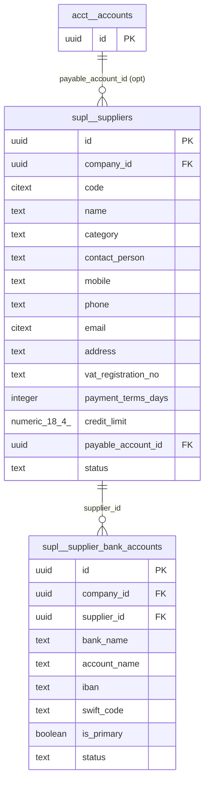
```mermaid
erDiagram
  supl__supplier_bank_accounts {
    uuid id PK
    uuid company_id FK
    uuid supplier_id FK
    text bank_name
    text account_name
    text iban
    text swift_code
    boolean is_primary
    text status
  }
  supl__suppliers {
    uuid id PK
    uuid company_id FK
    citext code
    text name
    text category
    text contact_person
    text mobile
    text phone
    citext email
    text address
    text vat_registration_no
    integer payment_terms_days
    numeric_18_4_ credit_limit
    uuid payable_account_id FK
    text status
  }
  acct__accounts {
    uuid id PK
  }
  supl__suppliers ||--o{ supl__supplier_bank_accounts : "supplier_id"
  acct__accounts ||--o{ supl__suppliers : "payable_account_id (opt)"
```

## Kitchen (`kds`)

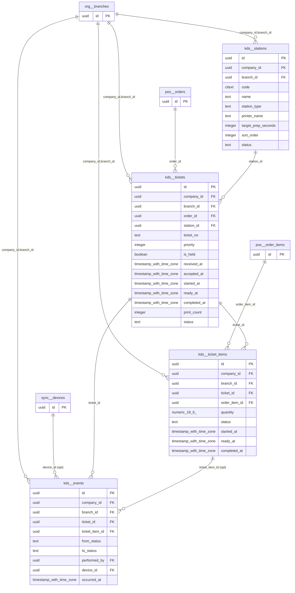
```mermaid
erDiagram
  kds__events {
    uuid id PK
    uuid company_id FK
    uuid branch_id FK
    uuid ticket_id FK
    uuid ticket_item_id FK
    text from_status
    text to_status
    uuid performed_by FK
    uuid device_id FK
    timestamp_with_time_zone occurred_at
  }
  kds__stations {
    uuid id PK
    uuid company_id FK
    uuid branch_id FK
    citext code
    text name
    text station_type
    text printer_name
    integer target_prep_seconds
    integer sort_order
    text status
  }
  kds__ticket_items {
    uuid id PK
    uuid company_id FK
    uuid branch_id FK
    uuid ticket_id FK
    uuid order_item_id FK
    numeric_18_6_ quantity
    text status
    timestamp_with_time_zone started_at
    timestamp_with_time_zone ready_at
    timestamp_with_time_zone completed_at
  }
  kds__tickets {
    uuid id PK
    uuid company_id FK
    uuid branch_id FK
    uuid order_id FK
    uuid station_id FK
    text ticket_no
    integer priority
    boolean is_held
    timestamp_with_time_zone received_at
    timestamp_with_time_zone accepted_at
    timestamp_with_time_zone started_at
    timestamp_with_time_zone ready_at
    timestamp_with_time_zone completed_at
    integer print_count
    text status
  }
  org__branches {
    uuid id PK
  }
  sync__devices {
    uuid id PK
  }
  pos__order_items {
    uuid id PK
  }
  pos__orders {
    uuid id PK
  }
  org__branches ||--o{ kds__events : "company_id,branch_id"
  sync__devices ||--o{ kds__events : "device_id (opt)"
  kds__tickets ||--o{ kds__events : "ticket_id"
  kds__ticket_items ||--o{ kds__events : "ticket_item_id (opt)"
  org__branches ||--o{ kds__stations : "company_id,branch_id"
  org__branches ||--o{ kds__ticket_items : "company_id,branch_id"
  pos__order_items ||--o{ kds__ticket_items : "order_item_id"
  kds__tickets ||--o{ kds__ticket_items : "ticket_id"
  org__branches ||--o{ kds__tickets : "company_id,branch_id"
  pos__orders ||--o{ kds__tickets : "order_id"
  kds__stations ||--o{ kds__tickets : "station_id"
```

## Delivery & riders (`dlv`)

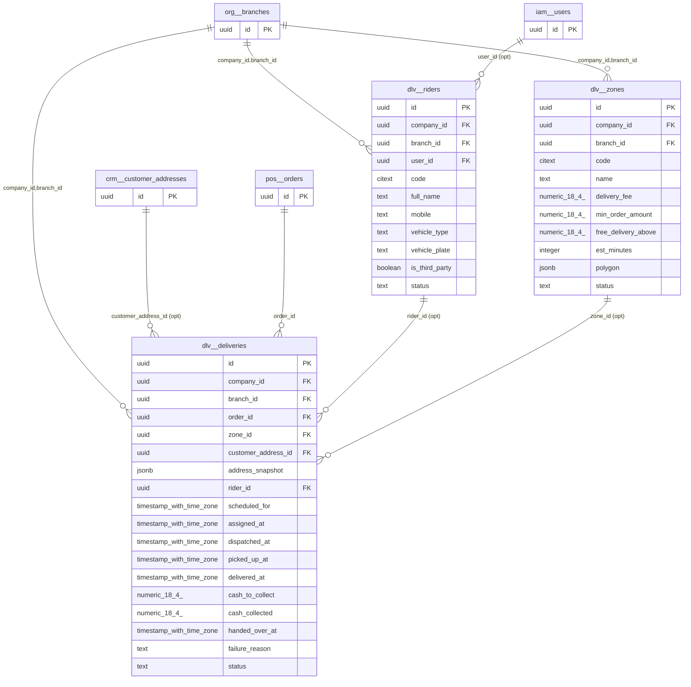
```mermaid
erDiagram
  dlv__deliveries {
    uuid id PK
    uuid company_id FK
    uuid branch_id FK
    uuid order_id FK
    uuid zone_id FK
    uuid customer_address_id FK
    jsonb address_snapshot
    uuid rider_id FK
    timestamp_with_time_zone scheduled_for
    timestamp_with_time_zone assigned_at
    timestamp_with_time_zone dispatched_at
    timestamp_with_time_zone picked_up_at
    timestamp_with_time_zone delivered_at
    numeric_18_4_ cash_to_collect
    numeric_18_4_ cash_collected
    timestamp_with_time_zone handed_over_at
    text failure_reason
    text status
  }
  dlv__riders {
    uuid id PK
    uuid company_id FK
    uuid branch_id FK
    uuid user_id FK
    citext code
    text full_name
    text mobile
    text vehicle_type
    text vehicle_plate
    boolean is_third_party
    text status
  }
  dlv__zones {
    uuid id PK
    uuid company_id FK
    uuid branch_id FK
    citext code
    text name
    numeric_18_4_ delivery_fee
    numeric_18_4_ min_order_amount
    numeric_18_4_ free_delivery_above
    integer est_minutes
    jsonb polygon
    text status
  }
  org__branches {
    uuid id PK
  }
  crm__customer_addresses {
    uuid id PK
  }
  pos__orders {
    uuid id PK
  }
  iam__users {
    uuid id PK
  }
  org__branches ||--o{ dlv__deliveries : "company_id,branch_id"
  crm__customer_addresses ||--o{ dlv__deliveries : "customer_address_id (opt)"
  pos__orders ||--o{ dlv__deliveries : "order_id"
  dlv__riders ||--o{ dlv__deliveries : "rider_id (opt)"
  dlv__zones ||--o{ dlv__deliveries : "zone_id (opt)"
  org__branches ||--o{ dlv__riders : "company_id,branch_id"
  iam__users ||--o{ dlv__riders : "user_id (opt)"
  org__branches ||--o{ dlv__zones : "company_id,branch_id"
```

## Aggregators (`agg`)

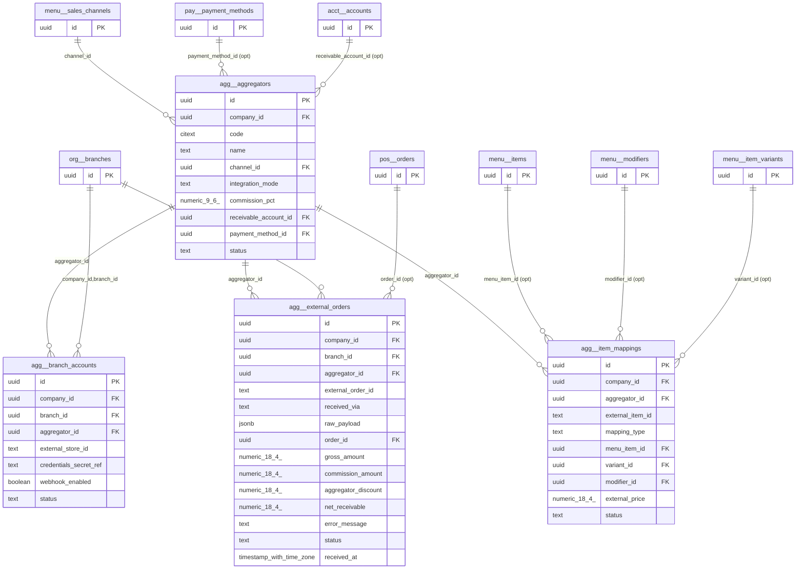
```mermaid
erDiagram
  agg__aggregators {
    uuid id PK
    uuid company_id FK
    citext code
    text name
    uuid channel_id FK
    text integration_mode
    numeric_9_6_ commission_pct
    uuid receivable_account_id FK
    uuid payment_method_id FK
    text status
  }
  agg__branch_accounts {
    uuid id PK
    uuid company_id FK
    uuid branch_id FK
    uuid aggregator_id FK
    text external_store_id
    text credentials_secret_ref
    boolean webhook_enabled
    text status
  }
  agg__external_orders {
    uuid id PK
    uuid company_id FK
    uuid branch_id FK
    uuid aggregator_id FK
    text external_order_id
    text received_via
    jsonb raw_payload
    uuid order_id FK
    numeric_18_4_ gross_amount
    numeric_18_4_ commission_amount
    numeric_18_4_ aggregator_discount
    numeric_18_4_ net_receivable
    text error_message
    text status
    timestamp_with_time_zone received_at
  }
  agg__item_mappings {
    uuid id PK
    uuid company_id FK
    uuid aggregator_id FK
    text external_item_id
    text mapping_type
    uuid menu_item_id FK
    uuid variant_id FK
    uuid modifier_id FK
    numeric_18_4_ external_price
    text status
  }
  menu__sales_channels {
    uuid id PK
  }
  pay__payment_methods {
    uuid id PK
  }
  acct__accounts {
    uuid id PK
  }
  org__branches {
    uuid id PK
  }
  pos__orders {
    uuid id PK
  }
  menu__items {
    uuid id PK
  }
  menu__modifiers {
    uuid id PK
  }
  menu__item_variants {
    uuid id PK
  }
  menu__sales_channels ||--o{ agg__aggregators : "channel_id"
  pay__payment_methods ||--o{ agg__aggregators : "payment_method_id (opt)"
  acct__accounts ||--o{ agg__aggregators : "receivable_account_id (opt)"
  agg__aggregators ||--o{ agg__branch_accounts : "aggregator_id"
  org__branches ||--o{ agg__branch_accounts : "company_id,branch_id"
  agg__aggregators ||--o{ agg__external_orders : "aggregator_id"
  org__branches ||--o{ agg__external_orders : "company_id,branch_id"
  pos__orders ||--o{ agg__external_orders : "order_id (opt)"
  agg__aggregators ||--o{ agg__item_mappings : "aggregator_id"
  menu__items ||--o{ agg__item_mappings : "menu_item_id (opt)"
  menu__modifiers ||--o{ agg__item_mappings : "modifier_id (opt)"
  menu__item_variants ||--o{ agg__item_mappings : "variant_id (opt)"
```

## Loyalty (`loy`)

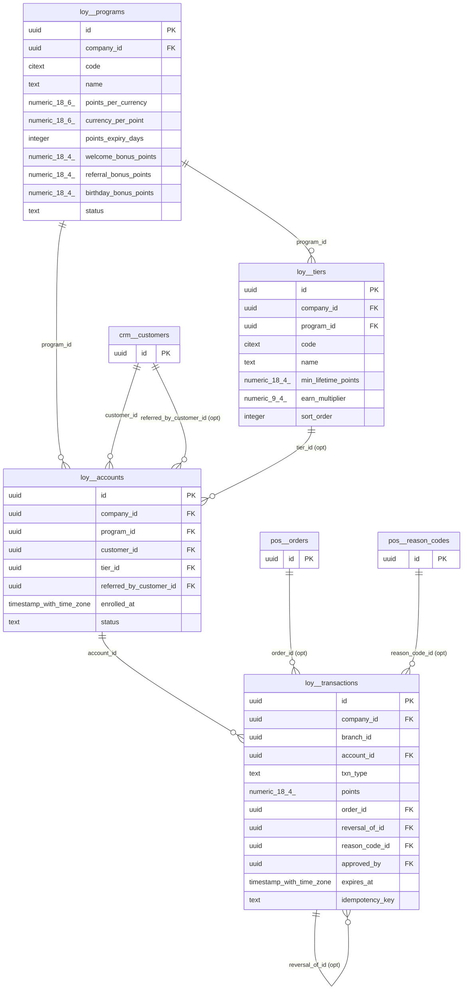
```mermaid
erDiagram
  loy__accounts {
    uuid id PK
    uuid company_id FK
    uuid program_id FK
    uuid customer_id FK
    uuid tier_id FK
    uuid referred_by_customer_id FK
    timestamp_with_time_zone enrolled_at
    text status
  }
  loy__programs {
    uuid id PK
    uuid company_id FK
    citext code
    text name
    numeric_18_6_ points_per_currency
    numeric_18_6_ currency_per_point
    integer points_expiry_days
    numeric_18_4_ welcome_bonus_points
    numeric_18_4_ referral_bonus_points
    numeric_18_4_ birthday_bonus_points
    text status
  }
  loy__tiers {
    uuid id PK
    uuid company_id FK
    uuid program_id FK
    citext code
    text name
    numeric_18_4_ min_lifetime_points
    numeric_9_4_ earn_multiplier
    integer sort_order
  }
  loy__transactions {
    uuid id PK
    uuid company_id FK
    uuid branch_id
    uuid account_id FK
    text txn_type
    numeric_18_4_ points
    uuid order_id FK
    uuid reversal_of_id FK
    uuid reason_code_id FK
    uuid approved_by FK
    timestamp_with_time_zone expires_at
    text idempotency_key
  }
  crm__customers {
    uuid id PK
  }
  pos__orders {
    uuid id PK
  }
  pos__reason_codes {
    uuid id PK
  }
  crm__customers ||--o{ loy__accounts : "customer_id"
  loy__programs ||--o{ loy__accounts : "program_id"
  crm__customers ||--o{ loy__accounts : "referred_by_customer_id (opt)"
  loy__tiers ||--o{ loy__accounts : "tier_id (opt)"
  loy__programs ||--o{ loy__tiers : "program_id"
  loy__accounts ||--o{ loy__transactions : "account_id"
  pos__orders ||--o{ loy__transactions : "order_id (opt)"
  pos__reason_codes ||--o{ loy__transactions : "reason_code_id (opt)"
  loy__transactions ||--o{ loy__transactions : "reversal_of_id (opt)"
```

## Marketing (`mkt`)

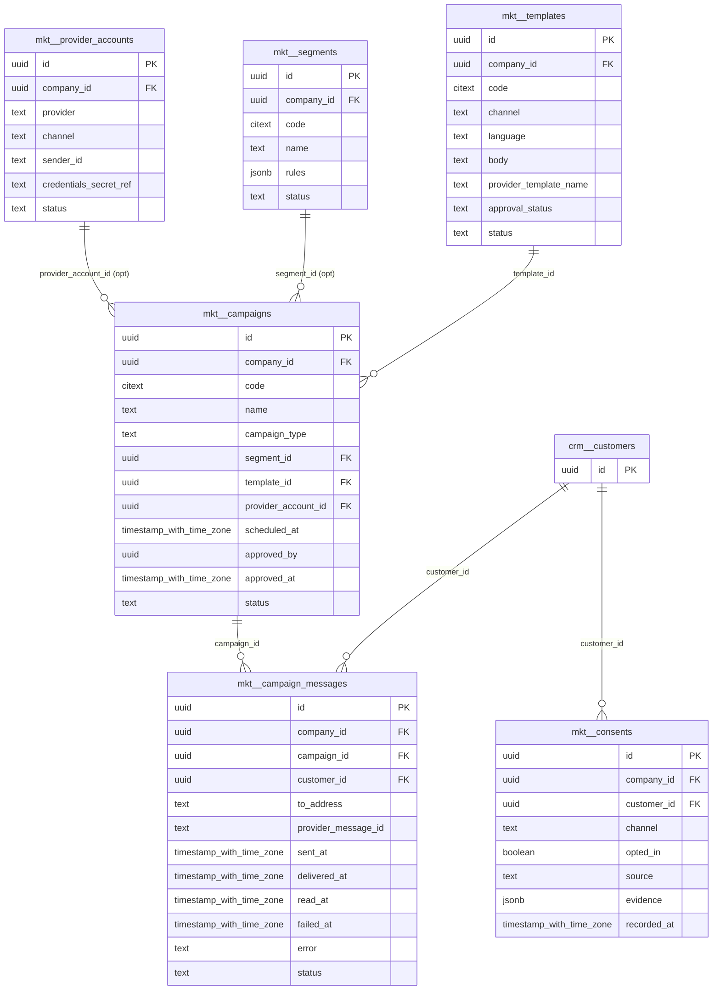
```mermaid
erDiagram
  mkt__campaign_messages {
    uuid id PK
    uuid company_id FK
    uuid campaign_id FK
    uuid customer_id FK
    text to_address
    text provider_message_id
    timestamp_with_time_zone sent_at
    timestamp_with_time_zone delivered_at
    timestamp_with_time_zone read_at
    timestamp_with_time_zone failed_at
    text error
    text status
  }
  mkt__campaigns {
    uuid id PK
    uuid company_id FK
    citext code
    text name
    text campaign_type
    uuid segment_id FK
    uuid template_id FK
    uuid provider_account_id FK
    timestamp_with_time_zone scheduled_at
    uuid approved_by
    timestamp_with_time_zone approved_at
    text status
  }
  mkt__consents {
    uuid id PK
    uuid company_id FK
    uuid customer_id FK
    text channel
    boolean opted_in
    text source
    jsonb evidence
    timestamp_with_time_zone recorded_at
  }
  mkt__provider_accounts {
    uuid id PK
    uuid company_id FK
    text provider
    text channel
    text sender_id
    text credentials_secret_ref
    text status
  }
  mkt__segments {
    uuid id PK
    uuid company_id FK
    citext code
    text name
    jsonb rules
    text status
  }
  mkt__templates {
    uuid id PK
    uuid company_id FK
    citext code
    text channel
    text language
    text body
    text provider_template_name
    text approval_status
    text status
  }
  crm__customers {
    uuid id PK
  }
  mkt__campaigns ||--o{ mkt__campaign_messages : "campaign_id"
  crm__customers ||--o{ mkt__campaign_messages : "customer_id"
  mkt__provider_accounts ||--o{ mkt__campaigns : "provider_account_id (opt)"
  mkt__segments ||--o{ mkt__campaigns : "segment_id (opt)"
  mkt__templates ||--o{ mkt__campaigns : "template_id"
  crm__customers ||--o{ mkt__consents : "customer_id"
```

## Expenses (`exp`)

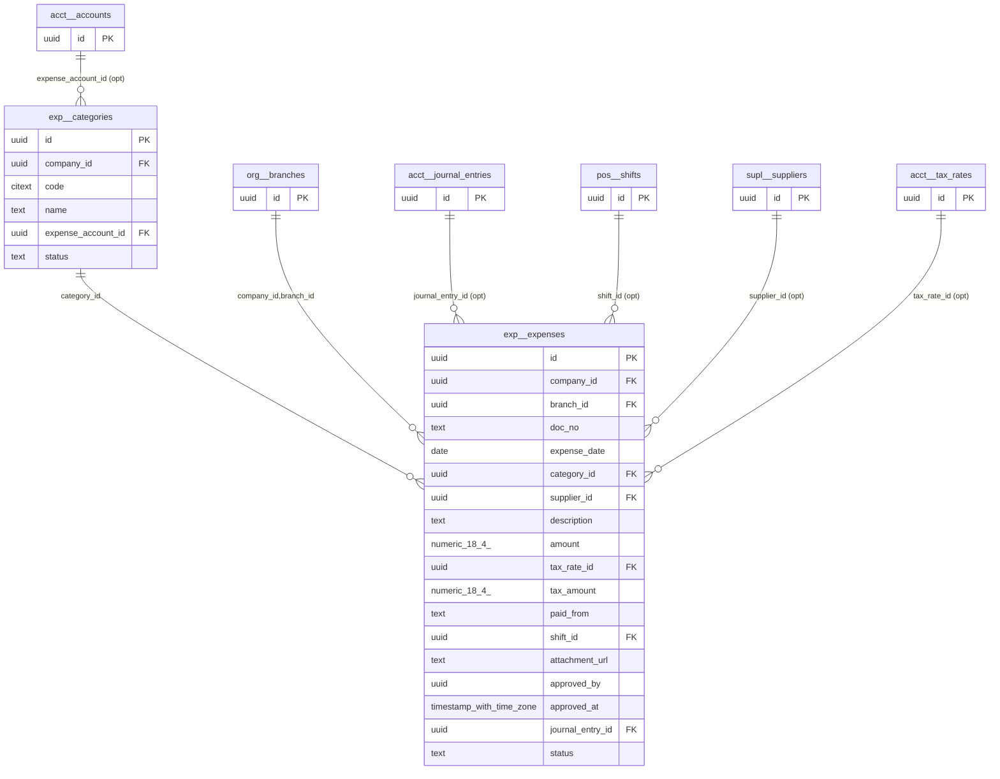
```mermaid
erDiagram
  exp__categories {
    uuid id PK
    uuid company_id FK
    citext code
    text name
    uuid expense_account_id FK
    text status
  }
  exp__expenses {
    uuid id PK
    uuid company_id FK
    uuid branch_id FK
    text doc_no
    date expense_date
    uuid category_id FK
    uuid supplier_id FK
    text description
    numeric_18_4_ amount
    uuid tax_rate_id FK
    numeric_18_4_ tax_amount
    text paid_from
    uuid shift_id FK
    text attachment_url
    uuid approved_by
    timestamp_with_time_zone approved_at
    uuid journal_entry_id FK
    text status
  }
  acct__accounts {
    uuid id PK
  }
  org__branches {
    uuid id PK
  }
  acct__journal_entries {
    uuid id PK
  }
  pos__shifts {
    uuid id PK
  }
  supl__suppliers {
    uuid id PK
  }
  acct__tax_rates {
    uuid id PK
  }
  acct__accounts ||--o{ exp__categories : "expense_account_id (opt)"
  exp__categories ||--o{ exp__expenses : "category_id"
  org__branches ||--o{ exp__expenses : "company_id,branch_id"
  acct__journal_entries ||--o{ exp__expenses : "journal_entry_id (opt)"
  pos__shifts ||--o{ exp__expenses : "shift_id (opt)"
  supl__suppliers ||--o{ exp__expenses : "supplier_id (opt)"
  acct__tax_rates ||--o{ exp__expenses : "tax_rate_id (opt)"
```

## Accounting & tax (`acct`)

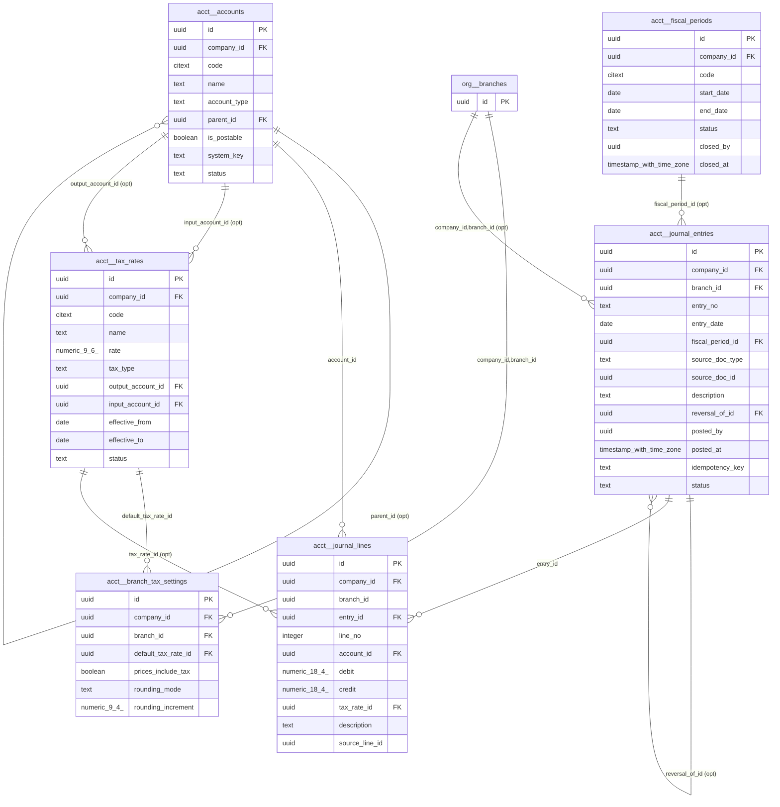
```mermaid
erDiagram
  acct__accounts {
    uuid id PK
    uuid company_id FK
    citext code
    text name
    text account_type
    uuid parent_id FK
    boolean is_postable
    text system_key
    text status
  }
  acct__branch_tax_settings {
    uuid id PK
    uuid company_id FK
    uuid branch_id FK
    uuid default_tax_rate_id FK
    boolean prices_include_tax
    text rounding_mode
    numeric_9_4_ rounding_increment
  }
  acct__fiscal_periods {
    uuid id PK
    uuid company_id FK
    citext code
    date start_date
    date end_date
    text status
    uuid closed_by
    timestamp_with_time_zone closed_at
  }
  acct__journal_entries {
    uuid id PK
    uuid company_id FK
    uuid branch_id FK
    text entry_no
    date entry_date
    uuid fiscal_period_id FK
    text source_doc_type
    uuid source_doc_id
    text description
    uuid reversal_of_id FK
    uuid posted_by
    timestamp_with_time_zone posted_at
    text idempotency_key
    text status
  }
  acct__journal_lines {
    uuid id PK
    uuid company_id FK
    uuid branch_id
    uuid entry_id FK
    integer line_no
    uuid account_id FK
    numeric_18_4_ debit
    numeric_18_4_ credit
    uuid tax_rate_id FK
    text description
    uuid source_line_id
  }
  acct__tax_rates {
    uuid id PK
    uuid company_id FK
    citext code
    text name
    numeric_9_6_ rate
    text tax_type
    uuid output_account_id FK
    uuid input_account_id FK
    date effective_from
    date effective_to
    text status
  }
  org__branches {
    uuid id PK
  }
  acct__accounts ||--o{ acct__accounts : "parent_id (opt)"
  org__branches ||--o{ acct__branch_tax_settings : "company_id,branch_id"
  acct__tax_rates ||--o{ acct__branch_tax_settings : "default_tax_rate_id"
  org__branches ||--o{ acct__journal_entries : "company_id,branch_id (opt)"
  acct__fiscal_periods ||--o{ acct__journal_entries : "fiscal_period_id (opt)"
  acct__journal_entries ||--o{ acct__journal_entries : "reversal_of_id (opt)"
  acct__accounts ||--o{ acct__journal_lines : "account_id"
  acct__journal_entries ||--o{ acct__journal_lines : "entry_id"
  acct__tax_rates ||--o{ acct__journal_lines : "tax_rate_id (opt)"
  acct__accounts ||--o{ acct__tax_rates : "input_account_id (opt)"
  acct__accounts ||--o{ acct__tax_rates : "output_account_id (opt)"
```

## Synchronization (`sync`)

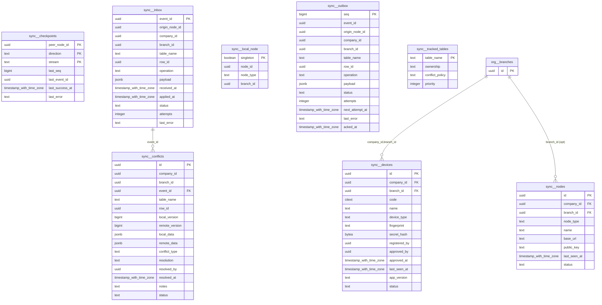
```mermaid
erDiagram
  sync__checkpoints {
    uuid peer_node_id PK
    text direction PK
    text stream PK
    bigint last_seq
    uuid last_event_id
    timestamp_with_time_zone last_success_at
    text last_error
  }
  sync__conflicts {
    uuid id PK
    uuid company_id
    uuid branch_id
    uuid event_id FK
    text table_name
    uuid row_id
    bigint local_version
    bigint remote_version
    jsonb local_data
    jsonb remote_data
    text conflict_type
    text resolution
    uuid resolved_by
    timestamp_with_time_zone resolved_at
    text notes
    text status
  }
  sync__devices {
    uuid id PK
    uuid company_id FK
    uuid branch_id FK
    citext code
    text name
    text device_type
    text fingerprint
    bytea secret_hash
    uuid registered_by
    uuid approved_by
    timestamp_with_time_zone approved_at
    timestamp_with_time_zone last_seen_at
    text app_version
    text status
  }
  sync__inbox {
    uuid event_id PK
    uuid origin_node_id
    uuid company_id
    uuid branch_id
    text table_name
    uuid row_id
    text operation
    jsonb payload
    timestamp_with_time_zone received_at
    timestamp_with_time_zone applied_at
    text status
    integer attempts
    text last_error
  }
  sync__local_node {
    boolean singleton PK
    uuid node_id
    text node_type
    uuid branch_id
  }
  sync__nodes {
    uuid id PK
    uuid company_id FK
    uuid branch_id FK
    text node_type
    text name
    text base_url
    text public_key
    timestamp_with_time_zone last_seen_at
    text status
  }
  sync__outbox {
    bigint seq PK
    uuid event_id
    uuid origin_node_id
    uuid company_id
    uuid branch_id
    text table_name
    uuid row_id
    text operation
    jsonb payload
    text status
    integer attempts
    timestamp_with_time_zone next_attempt_at
    text last_error
    timestamp_with_time_zone acked_at
  }
  sync__tracked_tables {
    text table_name PK
    text ownership
    text conflict_policy
    integer priority
  }
  org__branches {
    uuid id PK
  }
  sync__inbox ||--o{ sync__conflicts : "event_id"
  org__branches ||--o{ sync__devices : "company_id,branch_id"
  org__branches ||--o{ sync__nodes : "branch_id (opt)"
```

## Audit (`audit`)

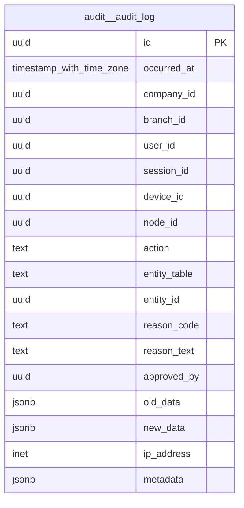
```mermaid
erDiagram
  audit__audit_log {
    uuid id PK
    timestamp_with_time_zone occurred_at
    uuid company_id
    uuid branch_id
    uuid user_id
    uuid session_id
    uuid device_id
    uuid node_id
    text action
    text entity_table
    uuid entity_id
    text reason_code
    text reason_text
    uuid approved_by
    jsonb old_data
    jsonb new_data
    inet ip_address
    jsonb metadata
  }
```

